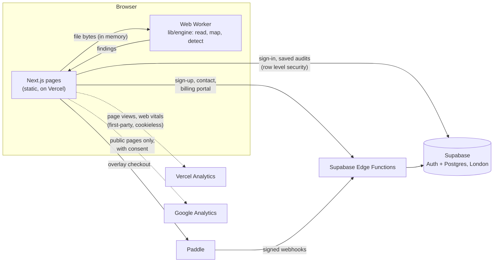

# PaidTwice

**Find the invoices you paid twice.** PaidTwice checks an accounts payable export for duplicate
vendor payments, including the near misses that an accounting system's own duplicate check lets
through. The file is read and checked inside the visitor's browser and is never uploaded.

**Live:** https://paidtwice.vercel.app &nbsp;·&nbsp; **Launch checklist:** [SETUP.md](SETUP.md)

## Contents

- [The product](#the-product)
- [How it works](#how-it-works)
- [Tech stack](#tech-stack)
- [Project structure](#project-structure)
- [Running it locally](#running-it-locally)
- [Configuration](#configuration)
- [Database](#database)
- [Server functions](#server-functions)
- [Payments](#payments)
- [Analytics and search](#analytics-and-search)
- [Testing](#testing)
- [Deployment](#deployment)
- [Operations](#operations)
- [Security notes and known limits](#security-notes-and-known-limits)
- [Ownership and transfer](#ownership-and-transfer)

## The product

### Who it is for

Accounts payable teams, controllers and the accountants and outsourced AP firms who work for them,
mainly in the US, UK and EU. Duplicate payments come from bills keyed twice, invoices re-sent by a
vendor, the same vendor set up twice, and invoice numbers typed or scanned slightly differently.
Built-in checks in QuickBooks, Xero, SAP and others mostly catch exact repeats only.

### A scan, step by step

1. **Choose a file.** CSV, TSV, TXT or Excel (.xlsx, and the HTML-table .xls files many ERPs
   produce), up to 80 MB. Exports from QuickBooks Online, Xero, NetSuite, Sage, SAP, Microsoft
   Dynamics and MYOB work, including grouped reports such as QuickBooks' Transaction List by Vendor.
   A sample file is built in.
2. **Check the columns.** Columns are recognised automatically (vendor, invoice number, dates,
   amount, debit/credit, currency, transaction type, status and more). Grouped reports where the
   vendor appears as a heading row are understood, and line-item exports can be combined per bill.
3. **Scan.** The engine runs in a Web Worker. 100,000 lines take a few seconds.
4. **Results.** The total at stake per currency, counts by check, and each finding with the rows
   involved, the reason in plain words, and a confidence grade (high, medium, low). Low-confidence
   findings are listed as leads and kept out of the headline total. Duplicates already reversed by a
   credit note are shown separately.
5. **Paid plans** unlock every finding, an Excel/CSV export, saved audits with a status, recovered
   amount and note for each finding, and a ready-to-send credit request email per vendor.

### What it catches

| Check | What it finds |
| --- | --- |
| Exact duplicate | Same vendor, invoice number and amount. |
| Invoice number formatted differently | Same vendor and amount; numbers match once prefixes, punctuation, leading zeros and OCR look-alikes are ignored (INV-00123 = 123, 1O23 = 1023). |
| Invoice number keying error | Same vendor, amount and invoice date; numbers differ by one transposed or mistyped character, judged against the vendor's own numbering pace. |
| Same invoice under two vendor records | Same invoice number and amount booked to two vendor records, usually a duplicate in the vendor master. |
| Same invoice, amount keyed differently | Same vendor and invoice number; amounts differ by a transposition, a shifted decimal point or a sales tax/VAT rate. |
| Same vendor, amount and date | At least one entry has no invoice number. |
| Same vendor and amount, close dates | Within a few days, where an invoice number is missing, or a bill also paid by a separate check or expense. Regular weekly or monthly charges are filtered out. |
| Look-alike vendor, same amount and date | Two vendor records with near-identical names paid the same amount on the same date. |

### Plans

| Plan | Price | What you get |
| --- | --- | --- |
| Free | $0, no account | Unlimited scans, the total at stake, counts by check, top 3 findings in full |
| Audit Pass | $149 one-off, 30 days | Every finding, Excel/CSV export, saved audits, recovery tracking, credit request emails |
| Pro | $99 a month or $990 a year | The same, ongoing; cancel any time |
| Firm | Quote | For accountants and outsourced AP teams with many clients or entities, billed by invoice |

Prices live in `lib/site.ts` (display) and in Paddle (what is charged). Paddle sells as merchant of
record, so it collects and files VAT and US sales tax.

## How it works



### The no-upload promise

- The file is read with `File.arrayBuffer()` and transferred to a Web Worker (`lib/engine/worker.ts`)
  that parses and scans it. Nothing in the engine touches the network, and the scanner keeps working
  offline once the page has loaded.
- A Content Security Policy (`lib/security-headers.ts`) tells the browser that pages may connect only
  to this site, the Supabase API and Paddle. Anyone can check it in their browser's developer tools.
- **Private pages** (`lib/private-routes.ts`): `/scan`, `/app`, `/account`, `/login`, `/signup`,
  `/reset` and `/pay`. Google Analytics never runs on them; the only third-party code they load is
  Paddle's checkout, when someone chooses to pay. When Google Analytics is configured, public pages
  get a policy that also allows Google's analytics hosts, and private pages keep the strict one.
- When Google Analytics is configured, a page that was first loaded as a public page never shows a
  private page, whether or not the visitor allowed analytics: links into private pages become full
  page loads, a file dropped on the home page is handed to a freshly loaded scan page through the
  browser's own storage (`lib/handoff.ts`, deleted as soon as it is read), and anything else that
  reaches a private page that way is reloaded. So the scanner always runs under the strict policy.
- Only paid users can save an audit, and a saved audit holds the summary and the flagged rows, never
  the file or the rows that were not flagged.

### The detection engine (`lib/engine`)

| File | Job |
| --- | --- |
| `readers.ts` | Reads CSV/TSV/TXT (UTF-8 with or without BOM, falling back to Windows-1252), XLSX (own reader on fflate) and HTML-table .xls. Explains unsupported files (old binary .xls, Numbers). |
| `mapping.ts` | Finds the header row, maps columns from a synonym list with scoring, detects grouped "vendor as heading" reports and line-item exports. |
| `parse.ts` | Amounts in any locale (1,234.56 / 1.234,56 / (12.00) / 12- / currency symbols), dates in any order with ambiguity detection, Excel serial dates. |
| `normalize.ts` | Invoice number keys (strict, loose, digits-only, prefix), vendor name normalisation (legal suffixes, Unicode), Jaro-Winkler similarity with guards against "Smith Plumbing" vs "Smith Roofing", one-edit and deletion-variant matching. |
| `detect.ts` | Classifies each row (bill, payment, credit, expense), applies signs per type, folds line items, skips voided and non-posting lines, runs the checks, groups matches (union-find), grades confidence and computes exposure. |
| `types.ts` | Shared types, the list of checks (`TESTS`) and default settings (14-day window for close dates, minimum amount 1, auto date order and decimal separator). |
| `worker.ts` | The Web Worker entry: load, choose sheet, scan, report progress. |
| `xlsx-writer.ts` | Writes the findings export. |

Design rules that keep the headline number honest:

- **Exposure** for a group is the sum of the payments minus the largest one: what was paid on top.
- Low-confidence findings are leads only, never part of the total.
- Typo matches need the same or nearby invoice dates and must fit the vendor's numbering pace.
- A reference a vendor uses on three or more documents across three or more months (an account or
  contract number) is not treated as a unique invoice number, and placeholders such as "N/A", bare
  years and repeated digits are ignored. Purchase orders and other non-posting lines are skipped.
- The precision test scans 40,000 clean, realistic lines and allows at most one high or medium
  finding; the same check has been run by hand on 250,000 lines with none.
- Finding ids are content-based hashes, so the same file gives the same ids every time.

### Accounts

- Sign-up goes through the `signup` server function, which creates the account already confirmed
  (so no email is needed to start) with rate limits per network. The browser then signs in.
- Sessions are kept by supabase-js in the browser's local storage.
- Password reset uses Supabase Auth email and lands on `/reset/update`.
- Account deletion (`delete-account` function) removes the account and every saved audit.

### Pages

| Route | What it is |
| --- | --- |
| `/` | Home: hero with drop zone, what it catches, pricing, FAQ |
| `/scan` | The scanner (private) |
| `/pricing` | Plans and checkout |
| `/security` | How data is handled, with "check it yourself" steps |
| `/guides`, `/guides/[slug]` | SEO guides (QuickBooks, Xero, SAP, recovering a duplicate payment), from `content/guides/*.md` |
| `/app`, `/app/audits/[id]` | Saved audits and recovery tracking (private, paid) |
| `/account` | Plan, billing portal, delete account (private) |
| `/login`, `/signup`, `/reset`, `/reset/update` | Sign-in pages (private) |
| `/pay` | Paddle's default payment link page for invoices and emailed payment links (private) |
| `/contact` | Contact form (stored in `leads`, optional email alert) |
| `/terms`, `/privacy`, `/refunds` | Legal pages from `content/legal/*.md`, with the business details filled in |
| `/sitemap.xml`, `/robots.txt`, `/opengraph-image` | Generated |

## Tech stack

| Part | Choice |
| --- | --- |
| Web app | Next.js 16 (App Router, Turbopack), React 19, TypeScript |
| Styling | Tailwind CSS 4; Atkinson Hyperlegible Next and Mono (self-hosted via Fontsource) |
| Parsing | papaparse (CSV), fflate (XLSX read and write), marked (Markdown content) |
| Backend | Supabase: Auth, Postgres with row level security, Edge Functions (Deno) |
| Payments | Paddle Billing (`@paddle/paddle-js` overlay checkout, webhooks, customer portal) |
| Email | Resend (optional, for contact alerts and as SMTP for Supabase Auth) |
| Hosting | Vercel (production deploys from `main`) |
| Analytics | Vercel Web Analytics and Speed Insights; Google Analytics 4 (optional, consent-based) |
| Tests | Vitest |

## Project structure

```
app/                      Next.js routes (see Pages above), layout, sitemap, robots, OG image
components/               UI: header, footer, pricing table, auth forms, dashboard, analytics
components/scanner/       Scanner flow: scan app, column mapping, results, finding card, credit email
content/guides/           SEO guides in Markdown (front matter: title, description)
content/legal/            Terms, privacy, refunds in Markdown with {{COMPANY}}, {{CONTACT}} etc.
lib/engine/               Detection engine (runs in a Web Worker)
lib/analytics.ts          Consent, Google Analytics loader and navigation guard, URL clean-up
lib/private-routes.ts     The list of private pages
lib/security-headers.ts   Content Security Policy and other headers (used by next.config.ts)
lib/handoff.ts            Hands a file from a public page to a fresh scan page
lib/scan-store.ts         Scan state for the tab, talks to the worker
lib/audits.ts             Saving and loading audits and findings
lib/paddle.ts             Paddle.js checkout
lib/supabase.ts           Supabase client and server-function calls
lib/site.ts               Name, URL, business details, prices
lib/content.ts            Markdown loading for guides and legal pages
lib/export.ts             Excel/CSV export of findings
lib/sample/generate.ts    Generator for the sample file and test data
public/sample/            The sample export (Northwind, 1,420 lines)
scripts/                  generate-sample, inspect-sample, perf (large-file timing), sim (vendor matching)
supabase/migrations/      Database schema, policies and functions
supabase/functions/       Edge Functions: signup, lead, paddle-webhook, billing-portal, delete-account
supabase/config.toml      Keeps JWT verification off for those functions (they check callers themselves)
tests/                    Engine, probes, precision, Paddle billing, analytics and headers
```

## Running it locally

Requirements: Node.js 22.12 or later (Vitest needs it; Vercel builds with the project's Node 24).

```bash
npm install
cp .env.example .env.local     # points at the live Supabase project; edit if you use another
npm run dev                    # http://localhost:3000
```

| Command | What it does |
| --- | --- |
| `npm run dev` | Development server |
| `npm run build` / `npm start` | Production build and server |
| `npm test` | All tests (Vitest) |
| `npm run lint` | Type check (`tsc --noEmit`) |
| `npm run sample` | Regenerates `public/sample/northwind-ap-export-2025.csv` |
| `npx tsx scripts/perf.ts 150000` | Times a scan of a generated file with that many lines |

## Configuration

### Vercel environment variables

All are public values that end up in the browser. They are read at build time, so redeploy after
changing them (Vercel → Deployments → ⋯ → Redeploy).

| Variable | Status | Purpose |
| --- | --- | --- |
| `NEXT_PUBLIC_SUPABASE_URL` | Set | Supabase project URL; also added to the Content Security Policy |
| `NEXT_PUBLIC_SUPABASE_PUBLISHABLE_KEY` | Set | Supabase publishable key (row level security protects the data) |
| `NEXT_PUBLIC_SITE_URL` | Set | Canonical URL for links, sitemap and legal pages; change when you add a domain |
| `NEXT_PUBLIC_COMPANY_NAME` | Optional | Legal name in the footer and legal pages (default "Dhali Services") |
| `NEXT_PUBLIC_COMPANY_ADDRESS` | Optional | Business address (default "Noida, Uttar Pradesh, India") |
| `NEXT_PUBLIC_COMPANY_COUNTRY` | Optional | Country of that address (default "India") |
| `NEXT_PUBLIC_SUPPORT_EMAIL` | Optional | Support mailbox; until set, pages point to the contact form |
| `NEXT_PUBLIC_GOOGLE_SITE_VERIFICATION` | Optional | Search Console HTML-tag token (a default token is built in) |
| `NEXT_PUBLIC_GA_MEASUREMENT_ID` | Optional | Google Analytics 4 ID (`G-...`); empty means Google Analytics is off |
| `NEXT_PUBLIC_PADDLE_ENV` | For payments | `sandbox` or `production` |
| `NEXT_PUBLIC_PADDLE_CLIENT_TOKEN` | For payments | Paddle client-side token |
| `NEXT_PUBLIC_PADDLE_PRICE_PASS` | For payments | Audit Pass price ID |
| `NEXT_PUBLIC_PADDLE_PRICE_PRO_MONTHLY` | For payments | Pro monthly price ID |
| `NEXT_PUBLIC_PADDLE_PRICE_PRO_YEARLY` | For payments | Pro yearly price ID |

### Supabase Edge Function secrets

Set in Supabase → Edge Functions → Secrets. `SUPABASE_URL` and the service key are provided by
Supabase itself.

| Secret | Used by | Purpose |
| --- | --- | --- |
| `PADDLE_WEBHOOK_SECRET` | paddle-webhook | Verifies Paddle's signature (the webhook refuses events without it) |
| `PADDLE_API_KEY` | paddle-webhook, billing-portal | Looks up customers and opens portal sessions (`customer.read`, `customer_portal_session.write`) |
| `PADDLE_ENV` | paddle-webhook, billing-portal | `sandbox` or `production` |
| `PADDLE_PRICE_PASS`, `PADDLE_PRICE_PRO_MONTHLY`, `PADDLE_PRICE_PRO_YEARLY` | paddle-webhook | Map prices to plans (or tag prices with custom data `{"plan":"pass"}` / `{"plan":"pro"}`) |
| `RESEND_API_KEY`, `LEAD_NOTIFY_EMAIL` | lead | Email alert for each contact form message |
| `LEAD_FROM_EMAIL` | lead | Sender for those alerts (default `PaidTwice <onboarding@resend.dev>`) |

## Database

Supabase project `paidtwice` (ref `alytxtpmnohqowvlazai`, London). Schema in `supabase/migrations`.
Row level security is on for every table.

| Table / view | Holds | Who can read or write |
| --- | --- | --- |
| `profiles` | Email, name, company, country (created by a trigger on sign-up) | Owner reads; owner updates name, company, country |
| `entitlements` | Audit Pass and Pro end dates, Pro status, Paddle customer and subscription ids | Owner reads; only the billing function or an admin writes |
| `audits` | One saved scan: name, file name, counts, totals, period, settings | Owner reads, renames, deletes; inserts only on a paid plan |
| `findings` | Flagged rows, reasons, grade, status, recovered amount, note | Owner reads and updates; inserts only on a paid plan |
| `audit_summaries` (view) | Per audit: confirmed, recovered and dismissed counts and amounts | Owner, through the caller's own permissions |
| `leads` | Contact form messages | Server only |
| `billing_events` | Every Paddle notification, once per event id | Server only |
| `billing_grants` | Audit Pass grants per transaction, with refund/chargeback revocations | Server only |
| `rate_limits` | Counters for sign-up and contact limits | Server only |

Functions: `private.current_plan()` and `private.has_paid_plan()` (used by policies, kept out of
the public API), `apply_billing_event()`
(applies one Paddle event atomically; callable by the server only), `hit_rate_limit()`, and
`admin_grant_plan(email, plan, days)` for manual grants.

## Server functions

All in `supabase/functions`, deployed with JWT verification off because each checks its caller
(see `supabase/config.toml`).

| Function | Called by | What it does |
| --- | --- | --- |
| `signup` | Sign-up form | Validates, rate-limits (5 per network per hour), creates a confirmed account |
| `lead` | Contact form | Stores the message, rate-limits, optionally emails it to you via Resend |
| `paddle-webhook` | Paddle | Verifies the signature, maps the event to an account change, applies it in one transaction |
| `billing-portal` | Account page | Opens Paddle's customer portal for the signed-in user |
| `delete-account` | Account page | Deletes the signed-in user and all their data |

## Payments

Paddle Billing, as merchant of record. Checkout runs as an overlay on the pricing page and carries the
user's id. Paddle notifies `paddle-webhook`, where `planEvent()` (`supabase/functions/_shared/paddle.ts`)
turns each event into one action and `apply_billing_event()` applies it once, in order:

- `transaction.completed` for the Audit Pass grants 30 days; for Pro it extends access to the end of
  the paid period plus 3 days' grace.
- `subscription.*` events mirror the Pro subscription, including scheduled cancellations.
- Approved full refunds and chargebacks (`adjustment.*`) take the access back.

Until Paddle is configured, buy buttons ask the visitor to create an account and then open the
contact form, so sales can be made by invoice and unlocked with `admin_grant_plan`. Full setup:
[SETUP.md, step 5](SETUP.md#5-paddle-payments).

## Analytics and search

### Google Search Console (done in code)

The verification tag `<meta name="google-site-verification" ...>` is on every page
(`lib/site.ts`, `googleSiteVerification`, overridable with `NEXT_PUBLIC_GOOGLE_SITE_VERIFICATION`).
In Search Console: Add property → **URL prefix** → `https://paidtwice.vercel.app/` → HTML tag →
Verify, then submit `sitemap.xml` under Sitemaps. A **Domain** property is verified with a DNS TXT
record (`google-site-verification=...`), which is only possible on a domain you own, not on
vercel.app. Step by step: [SETUP.md, step 7](SETUP.md#7-search-and-analytics).

### Vercel Web Analytics and Speed Insights (done in code)

`components/analytics.tsx` renders both on production deployments. They are first-party (served
from this site under `/_vercel/*`), set no cookies, and receive only the page path, with record ids
and the fragment removed and no query parameters except campaign tags (`utm_*`). Turn them on once
in Vercel → project → Analytics → Enable, and Speed Insights → Enable, then redeploy.

### Google Analytics 4 (ready, switched on by one variable)

Create a GA4 property and web data stream, set its measurement ID as `NEXT_PUBLIC_GA_MEASUREMENT_ID`
in Vercel and redeploy ([SETUP.md, step 7](SETUP.md#7-search-and-analytics) has every click). Then:

- An opt-in cookie banner appears on public pages, with equal "No thanks" and "Allow" buttons; the
  choice is kept for a year and can be changed from "Cookie settings" in the footer.
- Google's script loads only after "Allow", never on private pages, with Google signals and ad
  personalisation off.
- The privacy policy and security page switch to the wording that describes Google Analytics
  (blocks marked `<!-- if:ga -->` in `content/legal/privacy.md`).

### SEO

Static pages with canonical URLs, Open Graph image, `sitemap.xml`, `robots.txt` (account, saved
audit, sign-in and payment pages disallowed; the scanner stays indexable as a landing page),
Article structured data on guides, and four guides targeting searches such as "find duplicate
payments in QuickBooks Online".

## Testing

```bash
npm test
```

| Suite | Covers |
| --- | --- |
| `tests/engine.test.ts` | Parsing, mapping, normalisation and every check on planted duplicates |
| `tests/probes.test.ts` | Real-world file shapes that once fooled the engine, each with a known answer |
| `tests/precision.test.ts` | Clean realistic data at scale must produce (nearly) no high or medium findings |
| `tests/paddle.test.ts` | Webhook signature verification and the event-to-action mapping |
| `tests/analytics.test.ts` | Address clean-up, private routes, per-route security headers, privacy wording |

## Deployment

- **Website:** Vercel project `paidtwice`, linked to this repository. Every push to `main` deploys
  to production; other branches get preview deployments behind Vercel login.
- **Database changes:** add a file to `supabase/migrations` and apply it with the Supabase CLI
  (`supabase db push`) or the dashboard's SQL editor.
- **Server functions:**
  `supabase functions deploy <name> --project-ref alytxtpmnohqowvlazai`

## Operations

Run in Supabase → SQL Editor.

```sql
-- New enquiries
select created_at, email, company, country, topic, message from public.leads order by created_at desc;

-- Unlock or remove access by hand (for invoice sales)
select public.admin_grant_plan('buyer@company.com', 'pass', 30);
select public.admin_grant_plan('buyer@company.com', 'pro', 365);
select public.admin_grant_plan('buyer@company.com', 'free');

-- Who has access now
select u.email, e.pass_until, e.pro_until, e.pro_status, e.pro_cancel_at, e.note
from public.entitlements e join auth.users u on u.id = e.user_id
where e.pass_until > now() or e.pro_until > now();
```

Logs: Supabase → Edge Functions → (function) → Logs for sign-ups, contact alerts and webhooks;
Vercel → Logs for the website.

## Security notes and known limits

- Accounts are confirmed without an email check, so anyone could register an address they do not
  own. They gain nothing from it (a new, empty account), and the real owner can reset the password
  once SMTP is set up. Switch to confirmed sign-ups when email is in place (see SETUP.md, step 3).
- Password reset emails need custom SMTP: Supabase's built-in sender only reaches your own team.
- Leaked-password protection in Supabase Auth is off; it needs a paid Supabase plan.
- The Vercel Hobby plan does not allow commercial use, and free Supabase projects pause after a
  week without activity. Upgrade both before taking payments.
- No SOC 2 or ISO 27001 certification; the security page says so.

## Ownership and transfer

Built for Dhali Services. The repository, the Vercel project, the Supabase project and a domain
can all be transferred to a buyer; Paddle accounts cannot, so a buyer connects their own Paddle
account by changing the keys, price IDs and webhook secret. See
[SETUP.md](SETUP.md#handing-the-product-to-a-buyer).

All rights reserved.
